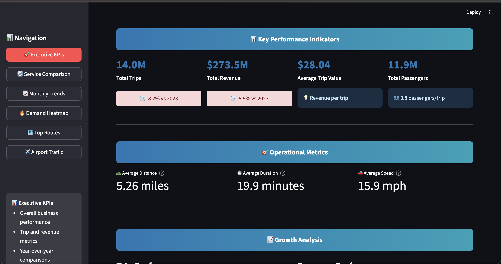
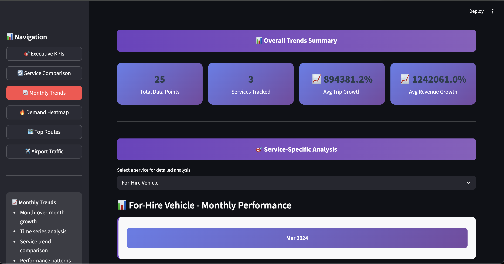
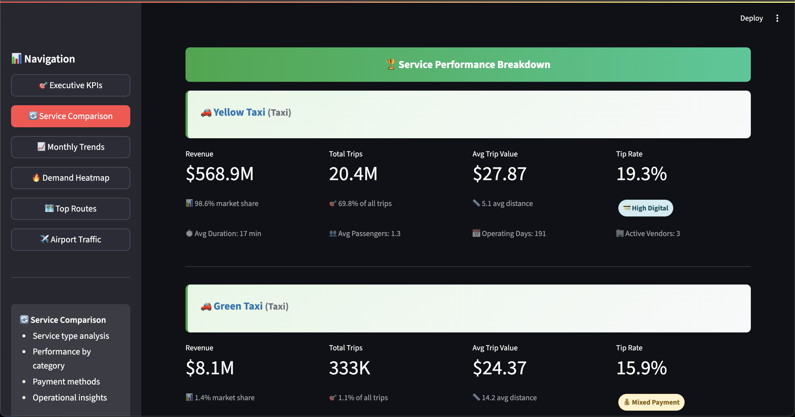
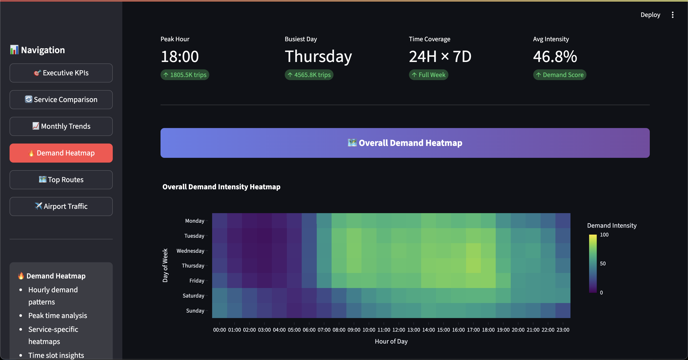
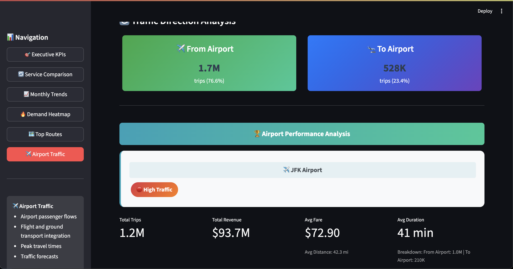

# CityRide-Analytics

## Project Overview
CityRide-Analytics is an end-to-end data engineering project that ingests, processes, and visualizes NYC Taxi & For-Hire Vehicle trip data. The pipeline uses **Airflow** for orchestration and gives users the flexibility to use either **PostgreSQL** or **Snowflake** as the analytics database based on configuration. File storage can be either **LocalStack S3** (for local testing) or **AWS S3**, depending on how the S3 connection is configured. Streamlit dashboards are used to visualize insights.

---

## Prerequisites
- Docker & Docker Compose installed
- Git
- Python 3.8+ (for any local scripts)

---

## Setup Instructions

### 0. Setup Python Virtual Environment
Create a Python 3.11 virtual environment:

```bash
python3.11 -m venv venv
```

Activate the virtual environment:

- On macOS/Linux:

```bash
source venv/bin/activate
```

- On Windows:

```bash
.\venv\Scripts\activate
```

Install dependencies from `requirements.txt`:

```bash
pip install -r requirements.txt
```

---

### 1. Clone the Repository
```bash
git clone https://github.com/tahersailana/CityRide-Analytics.git
```

### 2. Start Supporting Services
Start PostgreSQL first:

```bash
docker-compose up -d testdb_postgres
```

- LocalStack is optional. If you want to use **LocalStack S3** for local testing:

```bash
docker-compose up -d localstack
```

- Wait until Postgres is ready (`database system is ready to accept connections`) in logs.

---

### 3. Initialize Airflow Database
Use a temporary Airflow container to initialize the metadata database:

```bash
docker-compose run --rm airflow-webserver airflow db init
```

---

### 4. Create Airflow Admin User
```bash
docker-compose run --rm airflow-webserver airflow users create \
    --username admin \
    --firstname Admin \
    --lastname User \
    --role Admin \
    --email admin@example.com \
    --password admin
```

---

### 5. Start Airflow Services
```bash
docker-compose up -d airflow-webserver airflow-scheduler
```

- Check logs to ensure services are running:

```bash
docker-compose logs -f airflow-webserver
docker-compose logs -f airflow-scheduler
```

- Airflow Web UI will be available at: [http://localhost:8080](http://localhost:8080)

---

### 6. Create Airflow Connections

Create the following connections in the Airflow UI:

	1.  Open the Airflow Web UI: http://localhost:8080
	2.	Go to Admin → Connections.
	3.	Click “+” to add a new connection.
	4.	Fill in the connection details:

- **S3 Connection**:
  - Conn Id: `s3_conn`
  - Conn Type: `S3`
  - Extra: `{"aws_access_key_id": "<your_access_key>", "aws_secret_access_key": "<your_secret_key>", "region_name": "us-east-1", "endpoint_url": "http://localstack:4566"}` (if using LocalStack)

- **Postgres Connection** (optional):
  - Conn Id: `postgres_conn`
  - Conn Type: `Postgres`
  - Host: `testdb_postgres` (if your postgres is hosted on Docker else localhost)
  - Schema: `test_data`
  - Login: `user`
  - Password: `password123`
  - Port: `5432`

- **Snowflake Connection** (optional):
  - Conn Id: `snowflake_conn`
  - Conn Type: `Snowflake`
  - Login: `<your_snowflake_username>`
  - Password: `<your_snowflake_password>`
  - Account: `<your_snowflake_account>`  
    *Note:* If your Snowflake URL is like `https://app.snowflake.com/ekorbhk/no98289`, the account name would be `ekorbhk-no98289`.
  - Warehouse: `<your_snowflake_warehouse>`
  - Database: `<your_snowflake_database>`
  - Schema: `<your_snowflake_schema>`

You can configure either Postgres, Snowflake, or both; the DAG behavior will depend on the **`DATABASE_TO_RUN`** variable.

#### Airflow Variables

Create the following Airflow variables via UI:

	1.	Go to Admin → Variables in the Airflow UI.
	2.	Click “+” to add a new variable
    3. Add the values given down as key value pair.

  - `BUCKET_NAME` = your S3 bucket name

  - `DATABASE_TO_RUN` = which database to use (`POSTGRES` or `SNOWFLAKE`)


If you choose Snowflake, refer to the Snowflake account creation guide:

1. Sign up or login at [Snowflake](https://www.snowflake.com/).
2. Create a user and role for Airflow. Use the `sql/snowflake_user_creation.sql` script in the repository and execute it in the Snowflake UI.

---

### 7. Create Metadata, Fact, Dimension Tables and Views

- Execute the SQL files in the `sql` folder to create all necessary tables in the database (Postgres or Snowflake) before running DAGs.
- Ensure tables for metadata, fact, and dimensions are created according to their respective schemas.

---

### 8. Testing and Running

Now after the setup, if all DAGs are ready, Snowflake metadata tables, dimension tables and views are ready, you can load the data in tables through backfill using this command:

```bash
curl -X POST "http://localhost:8080/api/v1/dags/nyc_taxi_ingestion/dagRuns" \
-H "Content-Type: application/json" \
-u "admin:admin" \
-d '{"execution_date": "2025-07-05T00:00:00Z"}'
```

Note: Change the month of `execution_date` to load the corresponding data. The data loaded will be from the previous year of the month you provide.  
For example: for `execution_date` **2025-07-05**, the data load will be done for **2024-07**.  
Load the data for 5-6 months to get meaningful results.

After that, run the dashboard with the following command to see the analytics:

```bash
streamlit run visualization/main.py
```


**Note:** The dashboard pulls data from views and auto-refreshes every 5 minutes.

## Dashboard Previews

### Executive KPI


### Monthly Trends


### Service Comparison


### Demand Heatmaps


### Top Routes


### Airport Traffic


## Notes
- **LocalStack** emulates AWS S3; only start if using LocalStack for local testing.
- **Database Choice**: The DAG reads `DATABASE_TO_RUN` variable to determine which database to operate on.
- **Airflow Executor**: The project uses `LocalExecutor` for simplicity; Celery workers are not required.
- **Backfill Support**: Airflow DAGs can be backfilled manually for past months using:
- Ignore deprecation warnings regarding `sql_alchemy_conn`; they do not prevent functionality.
